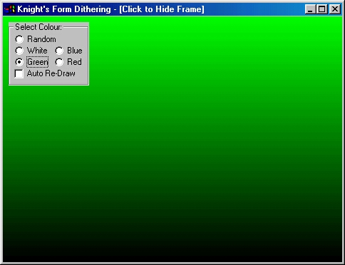



## Knight's Gradient Effect \(Commented\)

### Description

Dither Any Form The Colours: White, Red, Green, Blue or Random to Black (Similar To Setup Programz). Please Remember To Vote & Leave Comments & Suggestions, Thank You!
 
### More Info
 

             |
---                |---
**Submitted On**   |2000-07-24 10:24:02
**By**             |[Knight](https://github.com/Planet-Source-Code/PSCIndex/blob/master/ByAuthor/knight.md)
**Level**          |Beginner
**User Rating**    |4.7 (28 globes from 6 users)
**Compatibility**  |VB 3\.0, VB 4\.0 \(16\-bit\), VB 4\.0 \(32\-bit\), VB 5\.0, VB 6\.0
**Category**       |[Custom Controls/ Forms/  Menus](https://github.com/Planet-Source-Code/PSCIndex/blob/master/ByCategory/custom-controls-forms-menus__1-4.md)
**World**          |[Visual Basic](https://github.com/Planet-Source-Code/PSCIndex/blob/master/ByWorld/visual-basic.md)
**Archive File**   |[CODE\_UPLOAD80847242000\.zip](https://github.com/Planet-Source-Code/knight-knight-s-gradient-effect-commented__1-10011/archive/master.zip)

